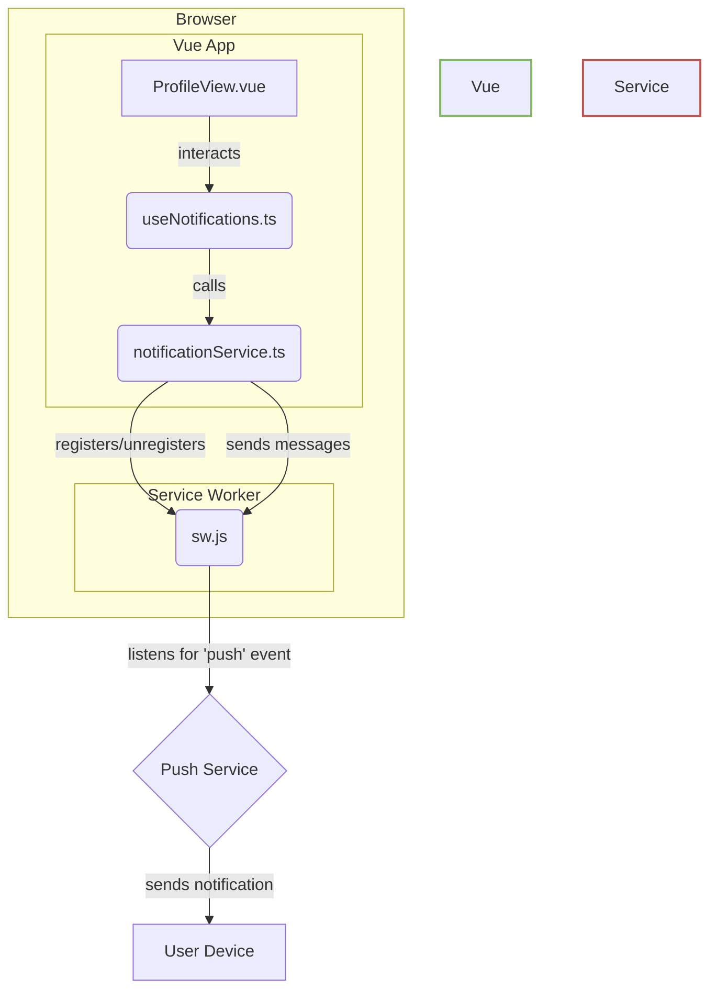
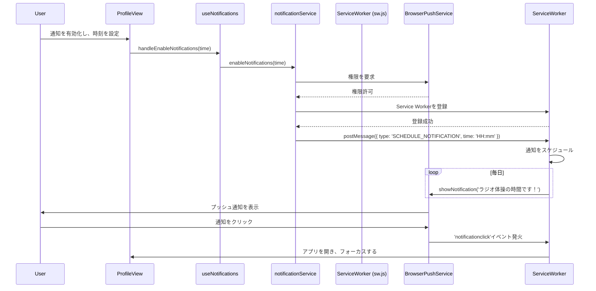
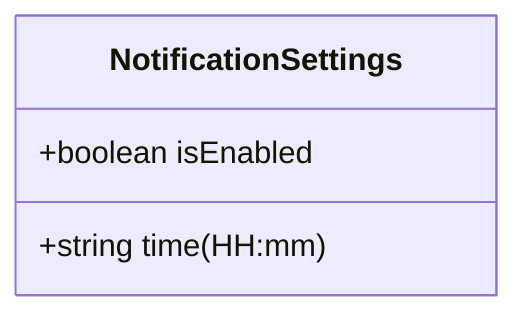

# 技術設計書: 通知機能の実装

## 1. 概要

本ドキュメントは、「ラジオ体操フィットネスアプリ」の通知機能を実装するための技術的な設計を定義する。要件定義に基づき、Service Workerを用いたWeb Push通知の実装方法、コンポーネント構成、データフローを明確にすることを目的とする。

## 2. アーキテクチャ概要

Vue 3 (Composition API) と Vite をベースとした既存のフロントエンドアーキテクチャに、Service Workerを追加してバックグラウンドでの通知機能を実現する。通知のロジックは`notificationService.ts`にカプセル化し、UIコンポーネントとのやり取りは`useNotifications.ts`コンポーザブルを介して行う。

### アーキテクチャ図 (Mermaid)

## 3. データフロー

ユーザーが通知を設定してから実際に通知を受け取るまでのデータフローは以下の通り。

### データフロー図 (Mermaid)

## 4. コンポーネントとサービスの設計

### 4.1. `sw.js` (Service Worker)

- **場所**: `public/sw.js` (Viteの設定でビルド時にルートに配置されるようにする)
- **責務**:
    - アプリケーションのインストール、アクティベーションをハンドルする。
    - `push`イベントをリッスンし、通知を表示する。
    - `notificationclick`イベントをリッスンし、通知がクリックされたときにアプリのウィンドウを開く、またはフォーカスする。
    - `message`イベントをリッスンし、Vueアプリケーションからの指示（通知のスケジュールやキャンセル）を受け取る。

### 4.2. `notificationService.ts`

- **場所**: `src/services/notificationService.ts`
- **責務**:
    - Service Workerの登録と管理。
    - ブラウザの通知権限（`Notification.permission`）の確認と要求。
    - Service Workerへのメッセージ送信（`postMessage`）による通知のスケジュールとキャンセルの指示。
    - VAPIDキーの管理（ただし、本アプリはサーバープッシュを行わないため、クライアントサイドのみのローカル通知として実装する）。

### 4.3. `useNotifications.ts`

- **場所**: `src/composables/useNotifications.ts`
- **責務**:
    - 通知設定（有効/無効、時刻）の状態をリアクティブに管理する。
    - `ProfileView.vue`からのユーザー操作を受け取り、`notificationService`の適切なメソッドを呼び出す。
    - 現在の通知権限の状態を`notificationService`から取得し、UIに提供する。

### 4.4. `ProfileView.vue`

- **場所**: `src/views/ProfileView.vue`
- **責務**:
    - `useNotifications`コンポーザブルを利用して、通知設定用のUI（トグルスイッチ、時刻入力）を表示・操作する。
    - ユーザーの操作に応じて`useNotifications`の関数を呼び出す。

## 5. データモデル

通知設定は`localStorage`に保存し、アプリケーションの起動時に読み込む。

### データモデル図 (Mermaid)

- **キー**: `radio-fit-app-notification-settings`
- **値**: `NotificationSettings`オブジェクトのJSON文字列

## 6. セキュリティ

- Service WorkerはHTTPS環境でのみ動作するため、本番環境ではHTTPSが必須となる。
- ユーザーの許可なく通知を送信することはない。権限要求はユーザーの明確なアクション（トグルをオンにするなど）に紐づける。

## 7. テスト計画

- **ユニットテスト (Vitest)**:
    - `notificationService.ts`: Service WorkerやNotification APIのモックを使用し、権限要求やメッセージ送信のロジックをテストする。
    - `useNotifications.ts`: `notificationService`をモックし、状態管理とUIロジックが正しく連携していることをテストする。
- **E2Eテスト (Playwright)**:
    - Service Workerの動作を直接テストするのは難易度が高いため、UI上の権限状態の表示や設定の保存が正しく行われることを中心にテストする。
    - 可能であれば、ブラウザの起動オプションで通知をダミーで許可し、通知設定のトグル操作がエラーなく完了することを確認する。